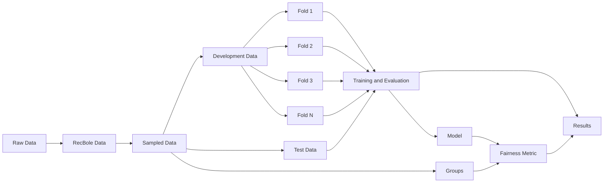

# Recommendation System's Fairness

This repository contains my final thesis work for graduating in Computer Science at UFES.

## Installation

This repository uses `uv` package manager for Python dependencies.

Run the following command to download necessary libraries:
```bash
uv sync
```

## Usage

### Setup

1. **Download the datasets**:
   - [LastFM-360K](https://ocelma.net/MusicRecommendationDataset/lastfm-360K.html)
   - [Yelp](https://business.yelp.com/data/resources/open-dataset/)

2. **Add the datasets to the folders**:
   - `data/raw/lastfm_360k`
   - `data/raw/yelp`

### Run experiments

You can run all the experiments with the command:
```bash
make run_experiments
```

This will run the experiment pipeline for all models and datasets.

To restrict the Yelp dataset to users whose predominant preference is restaurants or food, run:

```bash
make run_experiments USE_RESTAURANTS_USERS_ONLY=true
```

You can also run each script separately.

### Run separately

#### Transforming datasets

1. **Run the following command to transform the datasets into RecBole format**:
```bash
./scripts/transform_datasets.sh <dataset>
```
Possible flags:
   - `dataset`: The dataset to transform [`all`|`lastfm`|`yelp`]. Defaults to `all`.
   - `--use-restaurants-users-only`: Keep only Yelp users whose predominant preference is restaurants or food. Supported by `yelp` and `all`.

2. **Run the following script for sampling the dataset**:

```bash
./scripts/sample_datasets.sh <dataset>
```
Possible flags:
   - `dataset`: The dataset to transform [`all`|`lastfm`|`yelp`]. Defaults to `all`.

### Running models

1. **Run the script**:
```bash
./scripts/evaluate_models.sh --model <MODEL> --dataset <DATASET> --cross-validation --hyperparameter-search --folds N
```

Possible flags:
- `--model`: Choose `neumf`, `multivae`, or `all`. Defaults to `neumf`.
- `--dataset`: Choose `all`, `lastfm`, or `yelp`. Defaults to `all`.
- `--cross-validation`: Run user-stratified cross-validation.
- `--hyperparameter-search`: Search configurations from the model search YAML.
- `--folds`: Number of cross-validation folds. Defaults to `5`.

Examples for selecting models:

```bash
./scripts/evaluate_models.sh --model neumf --dataset lastfm
./scripts/evaluate_models.sh --model multivae --dataset yelp
./scripts/evaluate_models.sh --model all --dataset all
```

All results will be persisted in files `results/results_<dataset>.json`. Graphics and data tables are persisted in folders `results/<dataset>/`.

Existing results can be rendered again without retraining:

```bash
uv run python -m src.utils.results --dataset lastfm
uv run python -m src.utils.results --dataset yelp
```

## Architecture



All methodological decisions are documented in [method_documentation](docs/methodological_notes.md).
