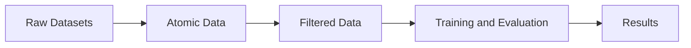

# Recommendation System's Fairness

This repository contains my final thesis work for graduating in Computer Science at UFES.

## Installation

This repository uses `uv` package manager for Python dependencies.

Run the following command to download necessary libraries:
```bash
uv sync
```

## Usage

### Transforming datasets

1. Download the datasets:
   - LastFM-360K
   - [Yelp](https://business.yelp.com/data/resources/open-dataset/)

2. Add the datasets to the folders:
   - `data/raw/lastfm_360k`
   - `data/raw/yelp`

3. Run the following command to transform the datasets into RecBole format:
```bash
./scripts/transform_datasets.sh <dataset>
```
You can run the script with three flags:
   - `all`: Run for both datasets (default).
   - `lastfm`: Run for LastFM-360K dataset only.
   - `yelp`: Run for Yelp dataset only.

### Running models

1. Run the script:
```bash
./scripts/evaluate_models.sh --cross_validation --hyperparameter-search --folds N
```

## Architecture

