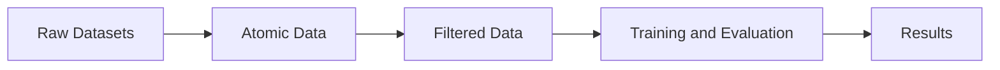

# Recommendation System's Fairness

This repository contains my final thesis work for graduating in Computer Science at UFES.

## Installation

This repository uses `uv` package manager for Python dependencies.

Run the following command to download necessary libraries:
```bash
uv sync
```

## Usage

## Architecture

