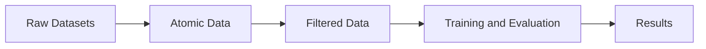

# Recommendation System's Fairness

This repository contains my final thesis work for graduating in Computer Science at UFES.

## Installation

This repository uses `uv` package manager for Python dependencies.

Run the following command to download necessary libraries:
```bash
uv sync
```

## Usage

### Transforming datasets

1. **Download the datasets**:
   - [LastFM-360K](https://ocelma.net/MusicRecommendationDataset/lastfm-360K.html)
   - [Yelp](https://business.yelp.com/data/resources/open-dataset/)

2. **Add the datasets to the folders**:
   - `data/raw/lastfm_360k`
   - `data/raw/yelp`

3. **Run the following command to transform the datasets into RecBole format**:
```bash
./scripts/transform_datasets.sh <dataset>
```
Possible flags:
   - `dataset`: The dataset to transform [`all`|`lastfm`|`yelp`]. Defaults to `all`.

4. **Run the following script for sampling the dataset**:

```bash
./scripts/sample_datasets.sh <dataset>
```
Possible flags:
   - `dataset`: The dataset to transform [`all`|`lastfm`|`yelp`]. Defaults to `all`.

### Running models

1. **Run the script**:
```bash
./scripts/evaluate_models.sh --model <MODEL> --dataset <DATASET> --cross-validation --hyperparameter-search --folds N
```

Possible flags:
- `--model`: Choose which model do you want to run. Defaults to `neumf`.
- `--dataset`: Choose `all`, `lastfm`, or `yelp`. Defaults to `all`.
- `--cross-validation`: Run user-stratified cross-validation.
- `--hyperparameter-search`: Search configurations from the model search YAML.
- `--folds`: Number of cross-validation folds. Defaults to `5`.

After the final test evaluation, the command also calculates the configured user-group metrics and updates `results/results_<dataset>.json`. Fairness is evaluated only on the final holdout and is not used during hyperparameter selection. The methodology and the latest execution checks are documented in [`docs/evaluation/group_fairness.md`](docs/evaluation/group_fairness.md).

The evaluation also regenerates the publication table data and PDF figures under `results/<dataset>/`. Existing results can be rendered again without retraining:

```bash
uv run python -m src.utils.results --dataset lastfm
uv run python -m src.utils.results --dataset yelp
```

## Architecture



All methodological decisions are documented in [method_documentation](docs/methodological_notes.md).
