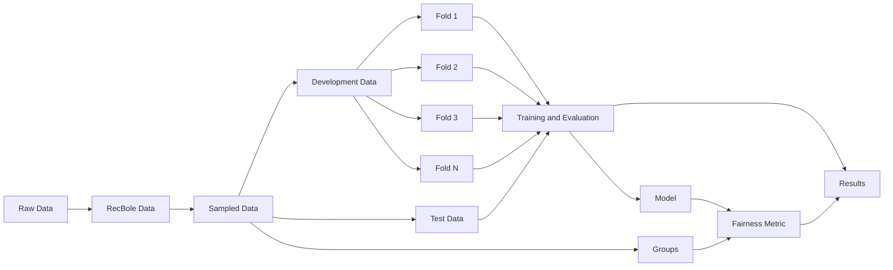

# Recommendation System's Fairness

This repository contains my final thesis work for graduating in Computer Science at UFES.

## Installation

This repository uses `uv` package manager for Python dependencies.

Run the following command to download necessary libraries:
```bash
uv sync
```

## Usage

### Setup

1. **Download the datasets**:
   - [LastFM-360K](https://ocelma.net/MusicRecommendationDataset/lastfm-360K.html)
   - [Yelp](https://business.yelp.com/data/resources/open-dataset/)

2. **Add the datasets to the folders**:
   - `data/raw/lastfm_360k`
   - `data/raw/yelp`

### Run experiments

Transform the raw datasets once before starting experiments:
```bash
make run_etl
```
For users with a strong preference for restaurants, run
`make run_etl USE_RESTAURANTS_USERS_ONLY=true` and use the same flag when
running experiments. Run the transformation again only when changing this
option or rebuilding the processed data. A run interrupted before its
transformation manifest is written can be safely repeated.

You can run all the experiments with the command:
```bash
make run_experiments USER_LIMIT=<N> ITEM_LIMIT=<M> SEED=<K> USE_RESTAURANTS_USERS_ONLY=<flag>
```

Possible flag values:
- `USER_LIMIT`: Quantity of users to be used for experimenting. Defaults to 1000.
- `ITEM_LIMIT`: Quantity of items to be used for experimenting. Defaults to 1000.
- `SEED`: Random seed used by sampling, splits, training, and fairness analysis. Defaults to 42.
- `USE_RESTAURANTS_USERS_ONLY`: Whether to use only users that have a strong preference for restaurants. Defaults to false. This must match the earlier transformation.

This creates an experiment identified by its seed and runs the pipeline for all
models and datasets. Samples are kept separately from result artifacts:

```text
data/sample/<users>_<items>/seed_<K>/<dataset>/
├── <dataset>.{inter,item,user}
├── <dataset>.sample_manifest.json
└── prepared split files

results/<users>_<items>/seed_<K>/<dataset>/
├── models/{neumf,multivae}.pth
├── models/checkpoints/fold_<F>/config_<C>/{neumf,multivae}.{pth,json}
├── results.json
├── k_clusters_fairness.json
└── sample_statistics/
```

Running the same limits and seed again resumes the experiment. A complete
experiment is skipped without changing its results; an incomplete experiment
reuses validated samples, splits, and model checkpoints. Experiments do not
run the ETL: pending seeds require processed LastFM and Yelp files with
completed transformation manifests, and the Yelp mode must match
`USE_RESTAURANTS_USERS_ONLY`. `make clean` preserves versioned samples and
removes only transformed data; run the transformation again after cleaning.

During cross-validation, each completed fold keeps its best model and validation
metrics in `models/checkpoints/fold_<F>/config_<C>/`. `config_<C>` is the
zero-based position in that model's hyperparameter list; the JSON records the
actual values and the checkpoint checksum. Interrupted runs reuse valid folds,
retrain only missing or damaged folds, and recover a completed final training
run when possible. Changed datasets or model configurations in the same
experiment directory cause an error; delete that experiment's results directory
manually to start over with the same user/item limits and seed.

Validation folds are assigned across users in a continuous rotation. Their total
interaction counts differ by at most one, while each user's development
interactions remain distributed as evenly as possible. Existing experiments
retain their recorded split version; use a new seed or limits for the updated
assignment without replacing their results.

You can also run each script separately.

### Run separately

#### Transforming datasets

1. **Run the following command to transform the datasets into RecBole format**:
```bash
./scripts/transform_datasets.sh <dataset> --use-restaurants-users-only
```
Possible flags:
   - `dataset`: The dataset to transform [`all`|`lastfm`|`yelp`]. Defaults to `all`.
   - `--use-restaurants-users-only`: Keep only Yelp users whose predominant preference is restaurants or food. Supported by `yelp` and `all`.

2. **Create an experiment and sample the dataset**:

```bash
EXPERIMENT=$(.venv/bin/python -m src.utils.experiments create --user-limit <N> --item-limit <M> --seed <K>)
./scripts/sample_datasets.sh <dataset> --experiment "$EXPERIMENT" --user-limit <N> --item-limit <M>
.venv/bin/python -m src.utils.experiments prepare --dataset <dataset> --experiment "$EXPERIMENT" --user-limit <N> --item-limit <M>
```
Possible flags:
   - `dataset`: The dataset to transform [`all`|`lastfm`|`yelp`]. Defaults to `all`.

### Running models

1. **Run the script**:
```bash
./scripts/evaluate_models.sh --model <MODEL> --dataset <DATASET> --experiment <seed_k> --user-limit <N> --item-limit <M> --cross-validation --hyperparameter-search --folds N
```

Possible flags:
- `--model`: Choose `neumf`, `multivae`, or `all`. Defaults to `neumf`.
- `--dataset`: Choose `all`, `lastfm`, or `yelp`. Defaults to `all`.
- `--experiment`: Seed-based experiment containing the prepared sample. Required.
- `--cross-validation`: Run user-stratified cross-validation.
- `--hyperparameter-search`: Search configurations from the model search YAML.
- `--folds`: Number of cross-validation folds. Defaults to `5`.
- `--fold-workers`: Maximum number of validation folds running continuously in
  parallel across hyperparameter candidates. Defaults to `1` and applies per
  model process; `--model all` can therefore run up to twice this number.

Validation ranks each positive interaction against 100 uniformly sampled
negative items (`uni100`). Hyperparameter selection therefore uses sampled
Recall, NDCG, and MRR. The final test and group-fairness analysis use full-sort
evaluation over the complete item catalog.

Training writes fold checkpoints and the final model. Fairness analysis is a separate step
that can be rerun without training:

```bash
./scripts/analyze_fairness.sh --model all --dataset all --experiment <seed_k> --user-limit <N> --item-limit <M>
```

The complete `make run_experiments` target invokes this analysis automatically.
To analyze an existing experiment through Make:

```bash
make analyze_experiment USER_LIMIT=<N> ITEM_LIMIT=<M> EXPERIMENT=<seed_k>
```

## Architecture


```mermaid
graph LR
    I["Raw Data"] --> A["RecBole Data"]
    A --> S["Sampled Data"]

    S --> B["Development Data"]
    S --> TE["Test Data"]

    B --> F1["Fold 1"]
    B --> F2["Fold 2"]
    B --> F3["Fold 3"]
    B --> FN["Fold N"]

    F1 --> TA["Training and Evaluation"]
    F2 --> TA
    F3 --> TA
    FN --> TA

    TE --> TA

    TA --> R["Results"]
    TA --> M["Model"]

    S --> GROUP["Groups"]
    GROUP --> F["Fairness Metric"]
    M --> F

    F --> R
```

All methodological decisions are documented in [method_documentation](docs/methodological_notes.md).
