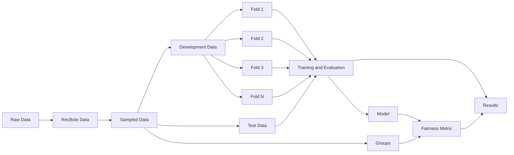

# Recommendation System's Fairness

This repository contains my final thesis work for graduating in Computer Science at UFES.

## Installation

This repository uses `uv` package manager for Python dependencies.

Run the following command to download necessary libraries:
```bash
uv sync
```

## Usage

### Setup

1. **Download the datasets**:
   - [LastFM-360K](https://ocelma.net/MusicRecommendationDataset/lastfm-360K.html)
   - [Yelp](https://business.yelp.com/data/resources/open-dataset/)

2. **Add the datasets to the folders**:
   - `data/raw/lastfm_360k`
   - `data/raw/yelp`

### Run experiments

You can run all the experiments with the command:
```bash
make run_experiments USER_LIMIT=<N> ITEM_LIMIT=<M> USE_RESTAURANTS_USERS_ONLY=<flag>
```

Possible flag values:
- `USER_LIMIT`: Quantity of users to be used for experimenting. Defaults to 1000.
- `ITEM_LIMIT`: Quantity of items to be used for experimenting. Defaults to 1000.
- `USE_RESTAURANTS_USERS_ONLY`: Wether to use only users that have a strong preference for restaurants. Defaults to false.

This creates the next versioned experiment (`01_exp`, `02_exp`, and so on) and
runs the pipeline for all models and datasets. Every execution is self-contained:

```text
results/<users>_<items>/<NN_exp>/<dataset>/
├── data/<dataset>/
├── models/{neumf,multivae}.pth
├── results.json
└── k_clusters_fairness.json
```

The stored dataset snapshot guarantees that the checkpoints can be analyzed even
after `data/sample` is replaced.

You can also run each script separately.

### Run separately

#### Transforming datasets

1. **Run the following command to transform the datasets into RecBole format**:
```bash
./scripts/transform_datasets.sh <dataset> --use-restaurants-users-only
```
Possible flags:
   - `dataset`: The dataset to transform [`all`|`lastfm`|`yelp`]. Defaults to `all`.
   - `--use-restaurants-users-only`: Keep only Yelp users whose predominant preference is restaurants or food. Supported by `yelp` and `all`.

2. **Create an experiment and sample the dataset**:

```bash
EXPERIMENT=$(.venv/bin/python -m src.utils.experiments create --user-limit <N> --item-limit <M>)
./scripts/sample_datasets.sh <dataset> --experiment "$EXPERIMENT" --user-limit <N> --item-limit <M>
.venv/bin/python -m src.utils.experiments snapshot --dataset <dataset> --experiment "$EXPERIMENT" --user-limit <N> --item-limit <M>
```
Possible flags:
   - `dataset`: The dataset to transform [`all`|`lastfm`|`yelp`]. Defaults to `all`.

### Running models

1. **Run the script**:
```bash
./scripts/evaluate_models.sh --model <MODEL> --dataset <DATASET> --experiment <NN_exp> --user-limit <N> --item-limit <M> --cross-validation --hyperparameter-search --folds N
```

Possible flags:
- `--model`: Choose `neumf`, `multivae`, or `all`. Defaults to `neumf`.
- `--dataset`: Choose `all`, `lastfm`, or `yelp`. Defaults to `all`.
- `--experiment`: Versioned experiment containing the dataset snapshot. Required.
- `--cross-validation`: Run user-stratified cross-validation.
- `--hyperparameter-search`: Search configurations from the model search YAML.
- `--folds`: Number of cross-validation folds. Defaults to `5`.

Validation ranks each positive interaction against 100 uniformly sampled
negative items (`uni100`). Hyperparameter selection therefore uses sampled
Recall, NDCG, and MRR. The final test and group-fairness analysis use full-sort
evaluation over the complete item catalog.

Training only writes the final checkpoints. Fairness analysis is a separate step
that can be rerun without training:

```bash
./scripts/analyze_fairness.sh --model all --dataset all --experiment <NN_exp> --user-limit <N> --item-limit <M>
```

The complete `make run_experiments` target invokes this analysis automatically.
To analyze an existing experiment through Make:

```bash
make analyze_experiment USER_LIMIT=<N> ITEM_LIMIT=<M> EXPERIMENT=<NN_exp>
```

## Architecture


```mermaid
graph LR
    I["Raw Data"] --> A["RecBole Data"]
    A --> S["Sampled Data"]

    S --> B["Development Data"]
    S --> TE["Test Data"]

    B --> F1["Fold 1"]
    B --> F2["Fold 2"]
    B --> F3["Fold 3"]
    B --> FN["Fold N"]

    F1 --> TA["Training and Evaluation"]
    F2 --> TA
    F3 --> TA
    FN --> TA

    TE --> TA

    TA --> R["Results"]
    TA --> M["Model"]

    S --> GROUP["Groups"]
    GROUP --> F["Fairness Metric"]
    M --> F

    F --> R
```

All methodological decisions are documented in [method_documentation](docs/methodological_notes.md).
