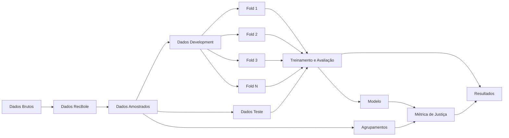

# Notas Metodológicas

Documento contendo todas as decisões metodológicas utilizadas no código.

## Dados

### LastFM-360K

- [`lastfm.py`](/home/miguel/Documents/UFES/TCC/recsys_fairness/src/data/lastfm.py)

    - Usuários que não contém nenhuma interação foram retirados | Interações sem usuário com metadados foram retiradas.
    - Artistas que não contém MBID e nem nome foram retirados.
    - Artistas sem MBID tiveram o nome encodado utilizado como ID.
    - Linhas de interações duplicadas (mesmo user_id e artist_id) foram somadas.
    - Idades não maiores do que 0 foram retiradas.

---

#### Interações

| Métrica                         |     Quantidade |
| :------------------------------ | -------------: |
| Interações totais do dataset    | **17.559.530** |
| Interações totais transformadas | **17.559.021** |

#### Limpeza e Validação

| Métrica                               | Quantidade |
| :------------------------------------ | ---------: |
| Linhas duplicadas agregadas           |    **421** |
| Artistas sem ID e nome                |      **1** |
| Valores de `play_count` não positivos |      **1** |
| Usuários que não contém metadados     |     **86** |
| Idades inválidas                      |     **57** |

#### Dimensões do Dataset

| Métrica                |  Quantidade |
| :--------------------- | ----------: |
| Quantidade de usuários | **359.347** |
| Quantidade de itens    | **268.602** |

---

### Yelp

- [`yelp.py`](/home/miguel/Documents/UFES/TCC/recsys_fairness/src/data/yelp.py)

    - Interações com comércios ou usuários sem metadados foram descartadas.
    - Usuários e comércios que possuem metadados mas não possuem interações foram descartados.

> Observações: No Yelp dataset um mesmo usuário avaliou um mesmo comércio mais de uma vez em 212.788 interações (aproximadamente 3,15%). Total de interações é 6.990.247. Por isso, na transformação dos dados foram mantidas apenas as interações mais recentes de um mesmo par usuário-item.

---

#### Interações

| Métrica                         |    Quantidade |
| :------------------------------ | ------------: |
| Interações totais do dataset    | **6.990.280** |
| Interações totais transformadas | **6.990.247** |

#### Limpeza e Validação

| Métrica                                  | Quantidade |
| :--------------------------------------- | ---------: |
| Interações removidas por usuário ausente |     **33** |

#### Dimensões do Dataset

| Métrica                |    Quantidade |
| :--------------------- | ------------: |
| Quantidade de usuários | **1.987.897** |
| Quantidade de itens    |   **150.346** |
| Usuários ativos        |   **100.370** |

#### Critérios de Atividade

| Métrica             |                   Valor |
| :------------------ | ----------------------: |
| Limiar de atividade |                  **92** |
| Data de referência  | **2022-01-19 19:48:45** |

---

## Treinamento e Avaliação

Toda a pipeline de divisão de dados, validação cruzada, busca de hiperparâmetros e resultados pode ser resumida pelo seguinte fluxograma:

1. `Dados Brutos`: Dados brutos dos datasets.
2. `Dados RecBole`: Dados no formato atômico do Recbole.
  - Nesta etapa, são realizados alguns filtros nos dados: 
3. `Dados Amostrados`: Dados amostrados do resultado da transformação.
  - Neste etapa, os dados são amostrados segundo os seguintes critérios: ...
4. `Dados Development`: Dados destinados para treino e validação. Representam 80% dos dados totais.
5. `Dados Teste`: Dados destinados para o teste final de generalização. Representam 20% dos dados totais.
6. `Fold i`:  Um fold específico dos dados destinado a validação cruzada.
7. `Treinamento e Avaliação`: Validação cruzada, tuning de hiperparâmetros e geração de métricas dos resultados do modelo.
8. `Modelo`: Modelo treinado em cima dos `Dados de Development` (com os melhores hiperparâmetros selecionados na validação cruzada).
9. `Agrupamentos`: Divisão de grupos no dados pelos metadados dos usuários. As divisão sempre serão por cada metadado presente nos `Dados Amostrados` + divisão por K-means e Agrupamento Hierárquico.
10. `Métrica de Justiça`: Métrica de justiça calculada a partir do modelo e dos agrupamentos de usuários.

> Observações:
>   - Todas as divisões dos dados foram feitas por usuário, ou seja, 80% dos dados para development e 20% para teste, de cada usuário. O mesmo vale para as divisões dentro dos folds.
>   - Para o treinamento do modelo final, foi utilizado o número de épocas equivalente a mediana das épocas da etapa de validação cruzada. Isso aconteceu porque a RecBole não faz early stopping quando a opção de validação está desativada.
>   - A validação cruzada serve especificamente para fazer o tuning de hiperparâmetros.