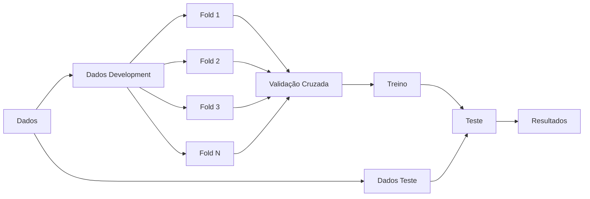

# Notas Metodológicas

Documento contendo todas as decisões metodológicas utilizadas no código.

## Dados

### LastFM-360K

- [`lastfm.py`](/home/miguel/Documents/UFES/TCC/recsys_fairness/src/data/lastfm.py)

    - Usuários que não contém nenhuma interação foram retirados | Interações sem usuário com metadados foram retiradas.
    - Artistas que não contém MBID e nem nome foram retirados.
    - Artistas sem MBID tiveram o nome encodado utilizado como ID.
    - Linhas de interações duplicadas (mesmo user_id e artist_id) foram somadas.
    - Idades não maiores do que 0 foram retiradas.

---

#### Interações

| Métrica                         |     Quantidade |
| :------------------------------ | -------------: |
| Interações totais do dataset    | **17.559.530** |
| Interações totais transformadas | **17.559.021** |

#### Limpeza e Validação

| Métrica                               | Quantidade |
| :------------------------------------ | ---------: |
| Linhas duplicadas agregadas           |    **421** |
| Artistas sem ID e nome                |      **1** |
| Valores de `play_count` não positivos |      **1** |
| Usuários que não contém metadados     |     **86** |
| Idades inválidas                      |     **57** |

#### Dimensões do Dataset

| Métrica                |  Quantidade |
| :--------------------- | ----------: |
| Quantidade de usuários | **359.347** |
| Quantidade de itens    | **268.602** |

---

### Yelp

- [`yelp.py`](/home/miguel/Documents/UFES/TCC/recsys_fairness/src/data/yelp.py)

    - Interações com comércios ou usuários sem metadados foram descartadas.
    - Usuários e comércios que possuem metadados mas não possuem interações foram descartados.

> Observações: No Yelp dataset um mesmo usuário avaliou um mesmo comércio mais de uma vez em 212.788 interações (aproximadamente 3,15%). Total de interações é 6.990.247.

---

#### Interações

| Métrica                         |    Quantidade |
| :------------------------------ | ------------: |
| Interações totais do dataset    | **6.990.280** |
| Interações totais transformadas | **6.990.247** |

#### Limpeza e Validação

| Métrica                                  | Quantidade |
| :--------------------------------------- | ---------: |
| Interações removidas por usuário ausente |     **33** |

#### Dimensões do Dataset

| Métrica                |    Quantidade |
| :--------------------- | ------------: |
| Quantidade de usuários | **1.987.897** |
| Quantidade de itens    |   **150.346** |
| Usuários ativos        |   **100.370** |

#### Critérios de Atividade

| Métrica             |                   Valor |
| :------------------ | ----------------------: |
| Limiar de atividade |                  **92** |
| Data de referência  | **2022-01-19 19:48:45** |

---

## Treinamento e Avaliação

Os dados foram divididos da seguinte maneira:

