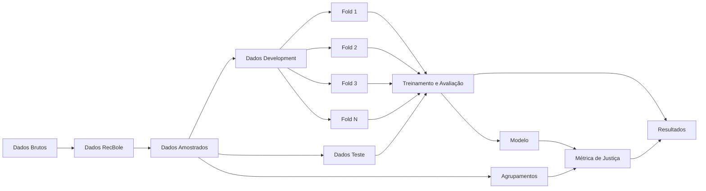

# Notas Metodológicas

Documento contendo todas as decisões metodológicas utilizadas no código.

## Dados

### LastFM-360K

- [`lastfm.py`](/home/miguel/Documents/UFES/TCC/recsys_fairness/src/data/lastfm.py)

    - Usuários que não contém nenhuma interação foram retirados | Interações sem usuário com metadados foram retiradas.
    - Artistas que não contém MBID e nem nome foram retirados.
    - Artistas sem MBID tiveram o nome encodado utilizado como ID.
    - Linhas de interações duplicadas (mesmo user_id e artist_id) foram somadas.
    - Idades não maiores do que 0 foram retiradas.

---

#### Interações

| Métrica                         |     Quantidade |
| :------------------------------ | -------------: |
| Interações totais do dataset    | **17.559.530** |
| Interações totais transformadas | **17.559.021** |

#### Limpeza e Validação

| Métrica                               | Quantidade |
| :------------------------------------ | ---------: |
| Linhas duplicadas agregadas           |    **421** |
| Artistas sem ID e nome                |      **1** |
| Valores de `play_count` não positivos |      **1** |
| Usuários que não contém metadados     |     **86** |
| Idades inválidas                      |     **57** |

#### Dimensões do Dataset

| Métrica                |  Quantidade |
| :--------------------- | ----------: |
| Quantidade de usuários | **359.347** |
| Quantidade de itens    | **268.602** |

---

### Yelp

- [`yelp.py`](/home/miguel/Documents/UFES/TCC/recsys_fairness/src/data/yelp.py)

    - Interações com comércios ou usuários sem metadados foram descartadas.
    - Usuários e comércios que possuem metadados mas não possuem interações foram descartados.

> Observações: No Yelp dataset um mesmo usuário avaliou um mesmo comércio mais de uma vez em 212.788 interações (aproximadamente 3,15%). Total de interações é 6.990.247. Por isso, na transformação dos dados foram mantidas apenas as interações mais recentes de um mesmo par usuário-item.

---

#### Interações

| Métrica                         |    Quantidade |
| :------------------------------ | ------------: |
| Interações totais do dataset    | **6.990.280** |
| Interações totais transformadas | **6.990.247** |

#### Limpeza e Validação

| Métrica                                  | Quantidade |
| :--------------------------------------- | ---------: |
| Interações removidas por usuário ausente |     **33** |

#### Dimensões do Dataset

| Métrica                |    Quantidade |
| :--------------------- | ------------: |
| Quantidade de usuários | **1.987.897** |
| Quantidade de itens    |   **150.346** |
| Usuários ativos        |   **100.370** |

#### Critérios de Atividade

| Métrica             |                   Valor |
| :------------------ | ----------------------: |
| Limiar de atividade |                  **92** |
| Data de referência  | **2022-01-19 19:48:45** |

---

## Treinamento e Avaliação

Toda a pipeline de divisão de dados, validação cruzada, busca de hiperparâmetros e resultados pode ser resumida pelo seguinte fluxograma:

1. `Dados Brutos`: Dados brutos dos datasets.
2. `Dados RecBole`: Dados no formato atômico do Recbole.
   - Nesta etapa, são realizados alguns filtros nos dados:
     - Usuários com metadados incompletos, ou não existentes, são descartados (assim como suas interações).
     - Itens não existentes nos metadados são descartados.
     - Interações com `play_count < 0` são descartadas (no caso do LastFM).
     - Artistas sem MBID e sem nome são descartados (assim como suas interações).
3. `Dados Amostrados`: Dados amostrados do resultado da transformação.
   - São selecionados os 1.000 itens com mais interações.
   - São considerados elegíveis os usuários com pelo menos 6 interações entre os itens selecionados. Desses usuários, 1.000 são sorteados com seed 42.
   - No LastFM, o `play_count` passa pela transformação `log1p` e, em seguida, pela normalização min-max para a escala de 1 a 5. As avaliações do Yelp são preservadas.
4. `Dados Development`: Dados destinados para treino e validação.
   - Para cada usuário, correspondem às interações restantes após a separação do teste.
5. `Dados Teste`: Dados destinados ao teste final de generalização.
   - Após o embaralhamento das interações de cada usuário com seed 42, são reservadas para teste `max(1, floor(20%))` interações. Por causa do arredondamento por usuário, a proporção global pode não ser exatamente 20%.
6. `Fold i`: Um fold específico dos dados destinado à validação cruzada.
   - Apenas os dados de development participam dos folds.
   - As interações de development de cada usuário são distribuídas circularmente entre os folds, de modo que cada interação seja usada uma vez para validação. Todos os candidatos a hiperparâmetros utilizam os mesmos folds.
7. `Treinamento e Avaliação`: Validação cruzada, tuning de hiperparâmetros e geração de métricas dos resultados do modelo.
   - Os hiperparâmetros são selecionados pela média do NDCG@10 nos folds. Em caso de empate, é mantido o primeiro candidato declarado no arquivo de configuração.
   - O teste final permanece isolado durante a seleção dos hiperparâmetros e é avaliado uma única vez após a escolha do melhor candidato.
   - A avaliação é feita por full-ranking: os itens já conhecidos pelo usuário são excluídos do ranking, e todas as interações de teste são consideradas relevantes.
8. `Modelo`: Modelo treinado sobre todos os `Dados Development`, com os melhores hiperparâmetros selecionados na validação cruzada.
   - O número de épocas do treinamento final é a mediana das melhores épocas obtidas nos folds. Como não há conjunto de validação nessa etapa, não é aplicado early stopping.
9. `Agrupamentos`: Divisão dos usuários em grupos por metadados e por algoritmos de agrupamento.
   - No LastFM, são utilizados os grupos de gênero, idade e atividade, sendo considerados ativos os 5% de usuários com mais interações no development.
   - No Yelp, são utilizados os grupos de atividade informada no perfil, quantidade de amigos e tempo de permanência na plataforma.
   - K-Means e agrupamento hierárquico utilizam os atributos dos usuários e sua atividade no development. Os atributos numéricos são padronizados, e o número de grupos entre 2 e 10 é escolhido pelo maior coeficiente de silhueta.
10. `Métrica de Justiça`: Métrica de justiça calculada a partir do modelo e dos agrupamentos de usuários.
    - A justiça é calculada somente sobre o teste final e não participa da seleção de hiperparâmetros.
    - As predições são limitadas à escala de 1 a 5, e a perda de cada grupo é o MSE de todas as suas interações de teste. O `Rgrp` mede a variação quadrática entre as perdas dos grupos.
